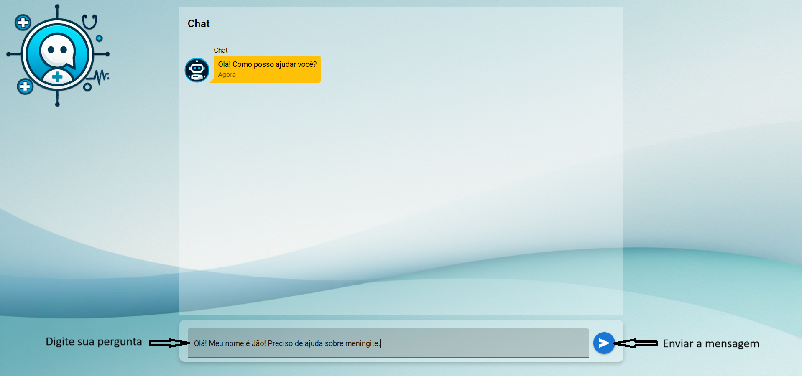
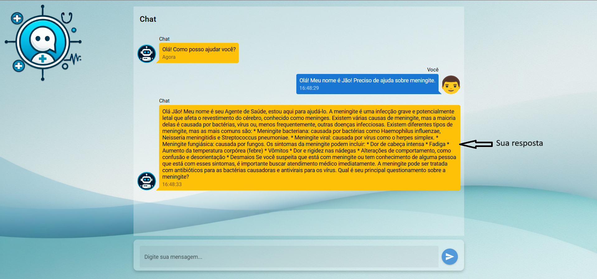

# SaudeAi (frontend)

Nesse projeto estarei usando a Api em Python <br>
GitHub: [https://github.com/FERNANDO-MATSUHASHI/ChatLlamaAPI-QDrant.git](https://github.com/FERNANDO-MATSUHASHI/ChatLlamaAPI-QDrant.git)

# Descrição

Link GitHub: [https://github.com/FERNANDO-MATSUHASHI/SaudeAI.git](https://github.com/FERNANDO-MATSUHASHI/SaudeAI.git). <br>

FrontEnd de um Chat voltado para a Saúde, com o intuito de ajudar pessoal com dúvidas na área, usando a inteligência artificial do Llama 3.1-8b.

# Tecnologias

- Vue.js Version: 3.4.18
- Quasar Framework Version: 2.16.0

# Como funciona
Aqui explicarei como funciona o SaudeAi

## Tela inicial


## Tela resposta


# Configuração do Projeto

## Instale as dependências

```bash
yarn
# or
npm install
```

### Rodar o projeto

```bash
quasar dev
```

### Compilar para produção

```bash
quasar build
```

### Personalize a configuração

Consulte [Configuring quasar.config.js](https://v2.quasar.dev/quasar-cli-vite/quasar-config-js).
